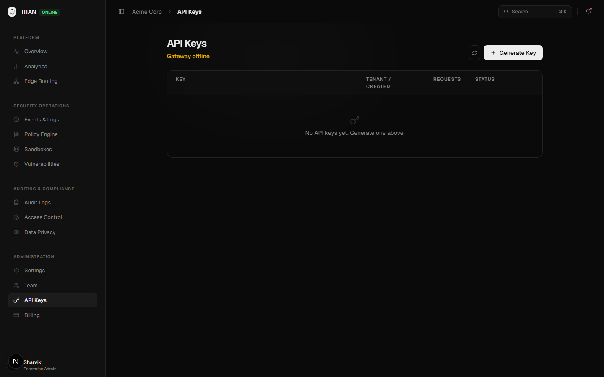
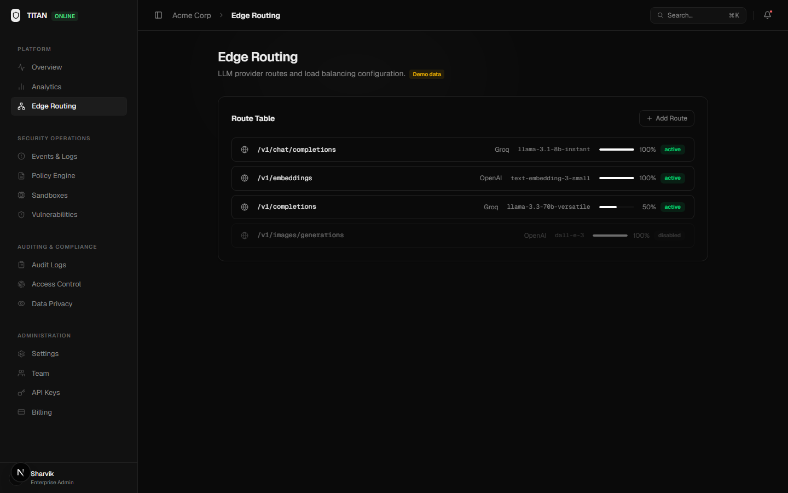
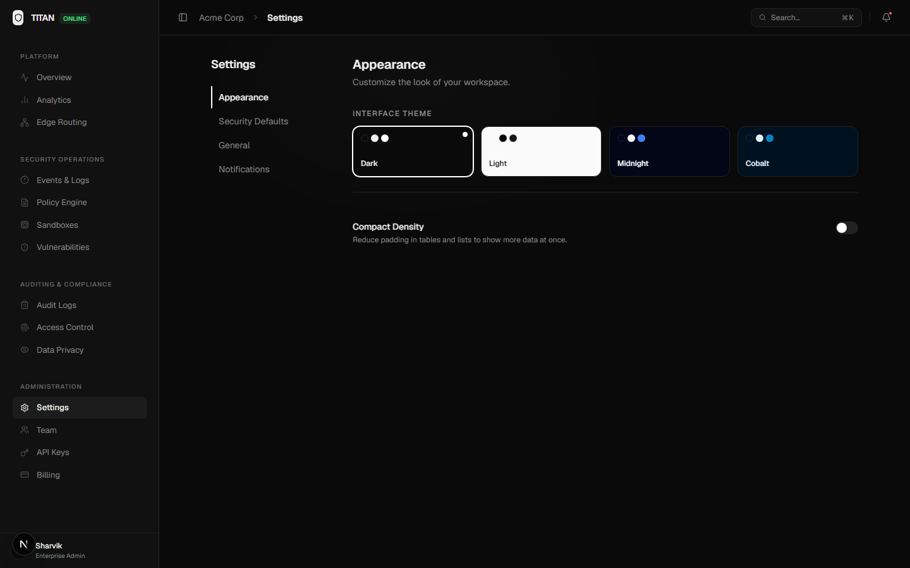
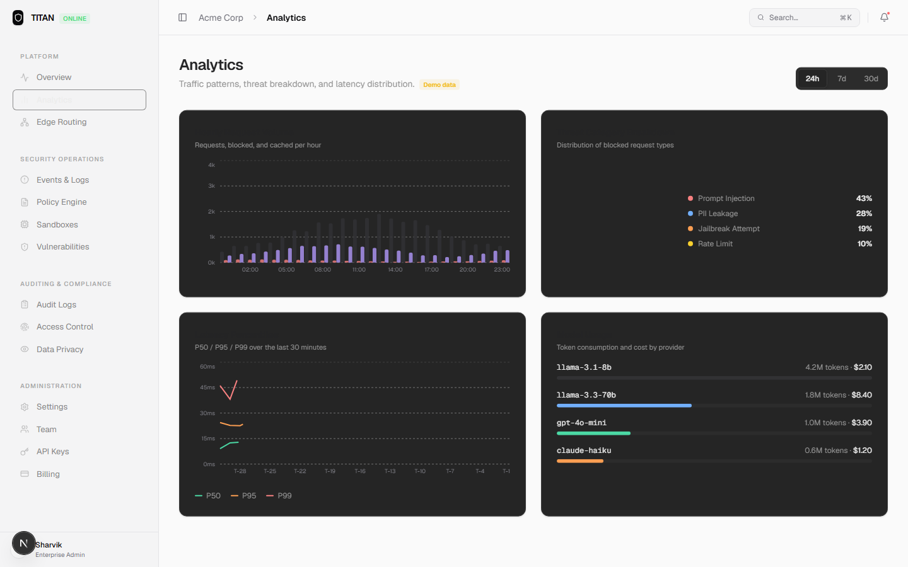

<div align="center">


# TITAN Gateway

### Zero-Trust LLM Security Gateway

**Put one enforceable security layer between your apps, your users, and every LLM provider.**

TITAN is an OpenAI-compatible reverse proxy and enterprise control plane for
LLM traffic. It inspects prompts before they leave your boundary, masks
PII/secrets, blocks prompt injection, enforces policy, controls cost, records
audit evidence, and gives security teams one place to govern AI usage.

[](https://golang.org)
[](https://python.org)
[](https://nextjs.org)
[](https://kafka.apache.org)
[](#editions-and-license)

</div>

---

## Why TITAN Exists

Enterprises are adopting LLMs faster than their security controls can follow.
Applications send sensitive prompts to external models, employees paste data
into web chat tools, and teams often have little evidence of what happened after
the fact.

TITAN turns LLM usage into a governed security control:

| Problem | TITAN control |
|---|---|
| Prompt injection and jailbreaks | ML + heuristic detection, custom guardrails, policy deny |
| PII, secrets, credentials, source-code leaks | Request masking, output scanning, Browser DLP |
| Shadow AI web usage | Browser extension for ChatGPT, Claude, Gemini, Perplexity |
| Unbounded model spend | Tenant API keys, RPM/TPM limits, monthly quotas, billing views |
| Weak governance | Cedar policy, RBAC, SSO, policy playground, version history |
| Missing audit evidence | Kafka/DB audit trail, SIEM export, compliance reports |

---

## What You Get

**Drop-in LLM firewall**

- OpenAI-compatible `/v1/*` proxy for OpenAI, Anthropic, Groq, Gemini, Ollama,
  LM Studio, vLLM, and other compatible providers.
- Existing SDKs keep working. Change `base_url` and API key.
- Provider failover replays the masked request body, not raw sensitive content.

**Security enforcement**

- Prompt-injection and jailbreak detection.
- Per-message PII masking with Microsoft Presidio.
- Secret and source-code leak prevention.
- Toxicity detection.
- Response-side output scanning, including streaming responses.
- Default-deny Cedar policy engine.
- Dashboard-managed no-code guardrails.
- Sandboxed WASM custom detectors in Enterprise builds.
- ASR-backed agent tool sandbox with Firecracker/Docker/simulated runtime
  selection, cancellation, and audit evidence.

**Enterprise control plane**

- Next.js dashboard with 17 operational tabs.
- Session auth, OIDC SSO, and four-tier RBAC.
- Tenant-scoped API keys and per-tenant settings.
- Usage metering, plan quotas, and billing visibility.
- Policy playground and immutable policy version history.
- Audit export, compliance coverage, and SIEM/webhook delivery.

**Endpoint DLP**

- Cross-browser extension for AI web UIs.
- Scans prompts, paste events, files, and images before upload.
- Reports metadata-only events into the same audit, dashboard, and alerting
  surfaces as API traffic.

---

## Architecture At A Glance

```text
Apps / SDKs / Browser DLP
        |
        v
TITAN Go Gateway  ->  ML Engine  ->  Upstream LLMs
        |
        +--> ASR: isolated agent tool execution
        +--> Redis: rate limits, cache, usage
        +--> CockroachDB: tenants, keys, policies, audit, settings
        +--> Kafka/Redpanda + ClickHouse: audit stream and analytics
        +--> Qdrant: semantic cache
        +--> Dashboard: RBAC, settings, policies, audit, compliance
```

The gateway data plane is a single Go binary. The intelligence plane is a
Python service for ML detection, PII masking, embeddings, file scanning, and
Browser DLP side-channel endpoints. The control plane is a Next.js dashboard.

For the deeper design and threat model, read:

- [Buyer Security Packet](docs/security/BUYER_SECURITY_PACKET.md)
- [Threat Model](docs/security/THREAT_MODEL.md)
- [Production Deployment Guide](docs/operations/PRODUCTION_DEPLOYMENT.md)
- [Architecture docs](docs/README.md#architecture--design--technical-analyses)

---

## Quick Start

Prerequisites: Docker 24+ and Docker Compose v2.

```bash
git clone https://github.com/SharvikS/LLM-Firewall.git
cd LLM-Firewall
cp .env.example .env
docker compose up -d --build
```

Open the dashboard:

| Surface | URL |
|---|---|
| Dashboard | `http://localhost:3000` |
| Gateway | `http://localhost:8080` |
| API docs | `http://localhost:8080/docs` |
| Grafana | `http://localhost:3001` |
| Redpanda Console | `http://localhost:8082` |

Default local dashboard login:

```text
admin@titan.local / admin@123
```

Seeded local API key:

```text
titan_dev_localkeyfortesting1234
```

Run the smoke test after the stack is healthy:

```bash
./scripts/smoke.sh
```

For the complete demo flow, use [docs/operations/DEMO_RUNBOOK.md](docs/operations/DEMO_RUNBOOK.md).

---

## Use It With Existing SDKs

TITAN is OpenAI-compatible. Point your client at the gateway:

```python
from openai import OpenAI

client = OpenAI(
    api_key="titan_dev_localkeyfortesting1234",
    base_url="http://localhost:8080/v1",
)
```

All security controls run before the request reaches the upstream provider.
For SDK examples, see [sdk/python](sdk/python) and [sdk/node](sdk/node).

---

## Dashboard

The dashboard is the day-to-day control plane for platform, security, and
compliance teams.

| Area | What it manages |
|---|---|
| Overview, Events, Analytics | Live traffic, risk, latency, model usage, blocked requests |
| Policy Engine | Cedar policies, playground evaluation, version history |
| Browser DLP, DLP Flags | Endpoint-side web UI blocks, redactions, repeat offenders |
| Audit Logs, Coverage | Audit search/export and OWASP/NIST coverage evidence |
| Sandboxes | ASR tool execution ledger, launch/cancel controls, backend/risk output |
| Settings, Edge Routing | Upstreams, guardrails, alerting, rate limits, per-tenant overrides |
| Team, API Keys, Billing | RBAC users, tenant keys, usage metering, plans and quotas |

## Product Tour

The screenshots below show the main buyer/operator workflows: executive
overview, investigation, policy governance, access control, audit, and routing.

### Command Center

<table>
  <tr>
    <td align="center">
      
      <br/>
      <sub><b>Overview</b> — live KPIs, blocked traffic, cache rate, latency, and recent threats.</sub>
    </td>
    <td align="center">
      
      <br/>
      <sub><b>Analytics</b> — request volume, risk categories, latency, and model usage.</sub>
    </td>
  </tr>
</table>

### Investigation And Governance

<table>
  <tr>
    <td align="center">
      
      <br/>
      <sub><b>Events</b> — real-time blocks, masks, Browser DLP events, and risk reasons.</sub>
    </td>
    <td align="center">
      
      <br/>
      <sub><b>Policy Engine</b> — create and evaluate Cedar policies without redeploying.</sub>
    </td>
  </tr>
  <tr>
    <td align="center">
      
      <br/>
      <sub><b>Audit Logs</b> — searchable evidence for requests and control-plane actions.</sub>
    </td>
    <td align="center">
      
      <br/>
      <sub><b>API Keys</b> — generate, copy, monitor, and revoke tenant-scoped keys.</sub>
    </td>
  </tr>
</table>

### Operations

<table>
  <tr>
    <td align="center">
      
      <br/>
      <sub><b>Edge Routing</b> — switch upstream providers and test gateway reachability.</sub>
    </td>
    <td align="center">
      
      <br/>
      <sub><b>Settings</b> — guardrails, alerting, security defaults, and tenant overrides.</sub>
    </td>
  </tr>
</table>

<p align="center">
  
  <br/>
  <sub><b>Light theme</b> — same operational surface for customer demos and stakeholder reviews.</sub>
</p>

---

## Security And Compliance Posture

TITAN is designed around these invariants:

- Invalid or missing API keys never reach an upstream model.
- Policy is default-deny; explicit denies win.
- Detected PII/secrets are masked before provider calls and failover retries.
- Raw prompts are not persisted in audit logs.
- Control-plane mutations are RBAC-gated and audit-recorded.
- Agent tool execution can be routed through ASR and recorded with backend,
  status, risk score, operator, and reason.
- Kafka is the preferred audit path; DB fallback preserves audit events when
  Kafka is unavailable or produce fails.
- Browser DLP reports metadata only, never prompt/file contents.
- Production mode rejects public default secrets.

Current proof material:

- [Buyer Security Packet](docs/security/BUYER_SECURITY_PACKET.md)
- [Threat Model](docs/security/THREAT_MODEL.md)
- [Dependency Triage](docs/security/DEPENDENCY_TRIAGE.md)
- [Load/SLO Evidence Plan](docs/security/LOAD_SLO_REPORT.md)
- [Red-team eval harness](scripts/redteam-eval.py)

Dependency and release gates run in GitHub Actions:

- Go tests and Enterprise build-tag tests.
- Dashboard lint, typecheck, and production build.
- ML pytest.
- Browser extension lint, tests, and package build.
- Helm lint/template.
- Dependency audits.
- Load-test harness compile.

---

## Browser DLP

The gateway protects API traffic. The Browser DLP extension protects human AI
web usage where traffic does not pass through the gateway.

It supports:

- ChatGPT, Claude, Gemini, and Perplexity.
- Prompt and paste scanning.
- File/image scanning with text extraction and OCR.
- Block, auto-redact, and warn-only modes.
- Fleet baseline controls from the dashboard.
- Unified audit, event feed, DLP flags, and SOC alerting.

Full extension docs: [browser-extension/README.md](browser-extension/README.md).

---

## Operations

| Need | Start here |
|---|---|
| Local demo | [Demo Runbook](docs/operations/DEMO_RUNBOOK.md) |
| Buyer walkthrough | [Enterprise Demo Script](docs/operations/ENTERPRISE_DEMO_SCRIPT.md) |
| Kubernetes deployment | [Production Deployment Guide](docs/operations/PRODUCTION_DEPLOYMENT.md) |
| Helm chart | [helm/titan](helm/titan) |
| Backup and restore | [DR Runbook](docs/operations/DR_RUNBOOK.md) |
| Testing guide | [Enterprise Testing Guide](docs/reference/testing.md) |
| Providers | [Provider Reference](docs/reference/PROVIDERS.md) |
| Security packet | [Buyer Security Packet](docs/security/BUYER_SECURITY_PACKET.md) |

---

## Repository Map

| Path | Purpose |
|---|---|
| [gateway](gateway) | Go data plane, Admin API, auth, policy, audit, proxy |
| [ml_engine](ml_engine) | Python analyzer, masking, embeddings, file/image scanning |
| [dashboard](dashboard) | Next.js control plane |
| [browser-extension](browser-extension) | Cross-browser endpoint DLP extension |
| [sdk/python](sdk/python), [sdk/node](sdk/node) | Admin SDKs |
| [helm/titan](helm/titan) | Kubernetes Helm chart |
| [loadtest](loadtest) | Load/stress test harness |
| [docs](docs) | Architecture, operations, security, testing |

---

## Current Readiness

TITAN is ready for demos, design-partner pilots, and controlled enterprise
validation. The codebase includes the core security controls, dashboard,
audit/compliance surfaces, deployment docs, and CI release gates needed to start
serious buyer conversations.

Before claiming broad production SLOs, run and archive:

- A production-like Helm deployment.
- The load-test matrix in [LOAD_SLO_REPORT.md](docs/security/LOAD_SLO_REPORT.md).
- Fresh dependency scan output from CI.
- Customer-specific SSO, SIEM, backup, and restore evidence.
- Third-party security review or pentest evidence.

---

## Editions And License

TITAN is open-core.

- **Community**: MIT-licensed gateway core, detection, masking, policy,
  dashboard basics, SDKs, cache, guardrails, and output scanning.
- **Enterprise**: commercially licensed build-tagged features such as OIDC SSO,
  metering/quotas, SOC alerting, compliance export, WASM plugins, and
  groundedness scoring.

```bash
go build ./...                  # Community build
go build -tags enterprise ./... # Enterprise build, license-gated at runtime
```

See [EDITIONS.md](EDITIONS.md), [LICENSE](LICENSE), and
[LICENSE-ENTERPRISE.md](LICENSE-ENTERPRISE.md).

---

## Contributing And Security

Contributions to the MIT core are welcome. Open-core boundaries are documented
in [EDITIONS.md](EDITIONS.md).

Do not open public issues for vulnerabilities. Use GitHub Security Advisories or
contact the maintainer privately. The target response window is 48 hours, with a
fix target of 14 days for confirmed high-impact issues.

---

<div align="center">

Built by **[sharvik.tech](https://sharvik.tech)**

**TITAN Gateway — govern every token before it leaves your boundary.**

</div>
