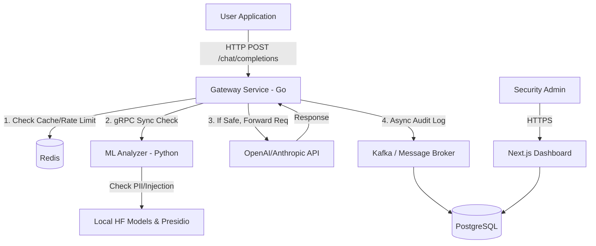

# Zero-Trust LLM Gateway ("LLM Firewall") - Architecture & Implementation Plan

This document outlines the blueprint for building an industry-grade, highly scalable LLM security gateway.

## 1. System Design & Architecture

To ensure low latency (crucial for LLM streaming) and robust security, we will use a **microservices architecture** separating the fast network routing from the heavier ML processing.

### **Core Components**

1.  **The API Gateway (Reverse Proxy):** 
    *   Acts as a drop-in replacement for LLM APIs (e.g., developers change their OpenAI Base URL to point to this gateway).
    *   Handles authentication, rate-limiting, and routing.
2.  **The Analyzer Engine (ML Service):** 
    *   Evaluates prompts *before* they go to the LLM (Prompt Injection, Jailbreak detection).
    *   Evaluates responses *after* they return from the LLM (PII leakage, sensitive data masking).
3.  **The Control Plane (Admin Dashboard):**
    *   A Web UI for security teams to set policies (e.g., "Mask SSNs," "Block Prompt Injections"), view analytics, and manage API keys.
4.  **Data Storage:**
    *   **PostgreSQL:** For persistent storage of users, policies, and audit logs.
    *   **Redis:** For high-speed caching of LLM responses and distributed rate limiting.

### **Architecture Diagram (Conceptual)**



---

## 2. Tools and Technologies (Industry-Grade)

We will use the best-in-class stack optimized for concurrency, machine learning, and modern web interfaces.

*   **Gateway Service:** **Go (Golang)**
    *   *Why:* Unbeatable for building high-throughput, low-latency network proxies.
*   **ML Analyzer Service:** **Python (FastAPI / gRPC)**
    *   *Why:* The undisputed king of ML ecosystems.
    *   *Libraries:* 
        *   **Microsoft Presidio:** Industry standard for PII detection and anonymization.
        *   **Hugging Face Transformers:** For running lightweight classification models (e.g., `deberta-v3-base-injection`) locally.
*   **Web UI (Control Plane):** **Next.js (React) + TypeScript + Tailwind CSS**
    *   *Why:* Fast to build, server-side rendering for SEO/performance, and excellent developer experience.
    *   *Components:* Shadcn/ui or Tremor (great for analytics dashboards).
*   **Inter-service Communication:** **gRPC / Protocol Buffers**
    *   *Why:* Much faster and more efficient than REST for communication between the Go Gateway and Python ML Engine.
*   **Databases:** **PostgreSQL** (Relational) & **Redis** (In-memory caching).
*   **Infrastructure:** **Docker**, **Kubernetes** (for scaling ML workloads), **GitHub Actions** (CI/CD).

---

## 3. Project Structure (Monorepo)

```text
llm-firewall/
├── gateway/                # Go reverse proxy
│   ├── cmd/                # Entry points
│   ├── internal/           # Core proxy logic, auth, rate limiting
│   └── proto/              # Protobuf definitions
├── analyzer/               # Python ML microservice
│   ├── app/                # gRPC/FastAPI server
│   ├── models/             # Local ML model weights & loaders
│   └── pipelines/          # PII masking & Injection detection logic
├── dashboard/              # Next.js Control Plane
│   ├── src/app/            # Pages (Analytics, Policies, API Keys)
│   └── src/components/     # UI Components
├── db/                     # Database migrations & schemas
├── deploy/                 # Docker-compose, Kubernetes manifests
└── README.md
```

---

## 4. Timeline Workflow (Project Lifecycle)

We will build this in iterative phases using an Agile approach.

### **Phase 1: The Proxy Foundation (Weeks 1-2)**
*   Initialize the Monorepo.
*   Build the Go proxy to successfully accept a request, forward it to OpenAI, and return the response (pass-through).
*   Implement basic API Key authentication.
*   **Milestone:** A working proxy that mimics the OpenAI API perfectly.

### **Phase 2: The ML Security Brain (Weeks 3-4)**
*   Set up the Python gRPC service.
*   Integrate **Microsoft Presidio** for PII detection (e.g., finding Emails, Credit Cards).
*   Integrate a lightweight prompt injection detection model.
*   Connect the Go Gateway to the Python service via gRPC to "block" or "allow" requests.
*   **Milestone:** The proxy can now block malicious prompts and mask sensitive data.

### **Phase 3: State & Speed (Weeks 5-6)**
*   Integrate Redis for request caching (if a user asks the exact same prompt, return from cache instead of calling OpenAI).
*   Implement Token rate-limiting (e.g., max 10,000 tokens per minute per API key).
*   Connect PostgreSQL to store audit logs (who made what request, and was it blocked?).
*   **Milestone:** A production-ready, performant backend.

### **Phase 4: The Control Plane (Weeks 7-8)**
*   Build the Next.js Dashboard.
*   Create interfaces to view Audit Logs (metrics on blocked vs. allowed requests).
*   Create UI to toggle security policies (e.g., a switch to turn on/off PII masking).
*   **Milestone:** A beautiful interface for managing the firewall.

### **Phase 5: Deployment & Polish (Weeks 9-10)**
*   Write Dockerfiles for all services.
*   Create a `docker-compose.yml` for easy one-click local deployment.
*   Write unit tests and load tests (using tools like `k6`).
*   **Milestone:** Release version 1.0.
