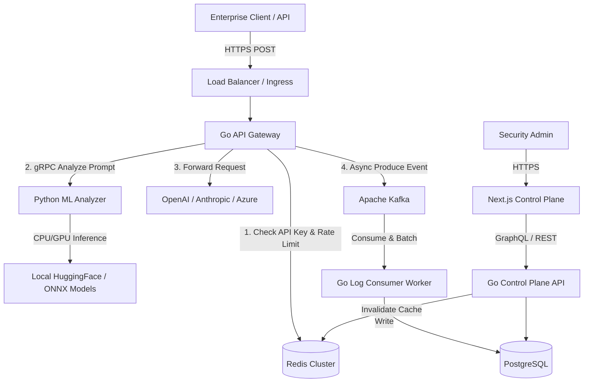
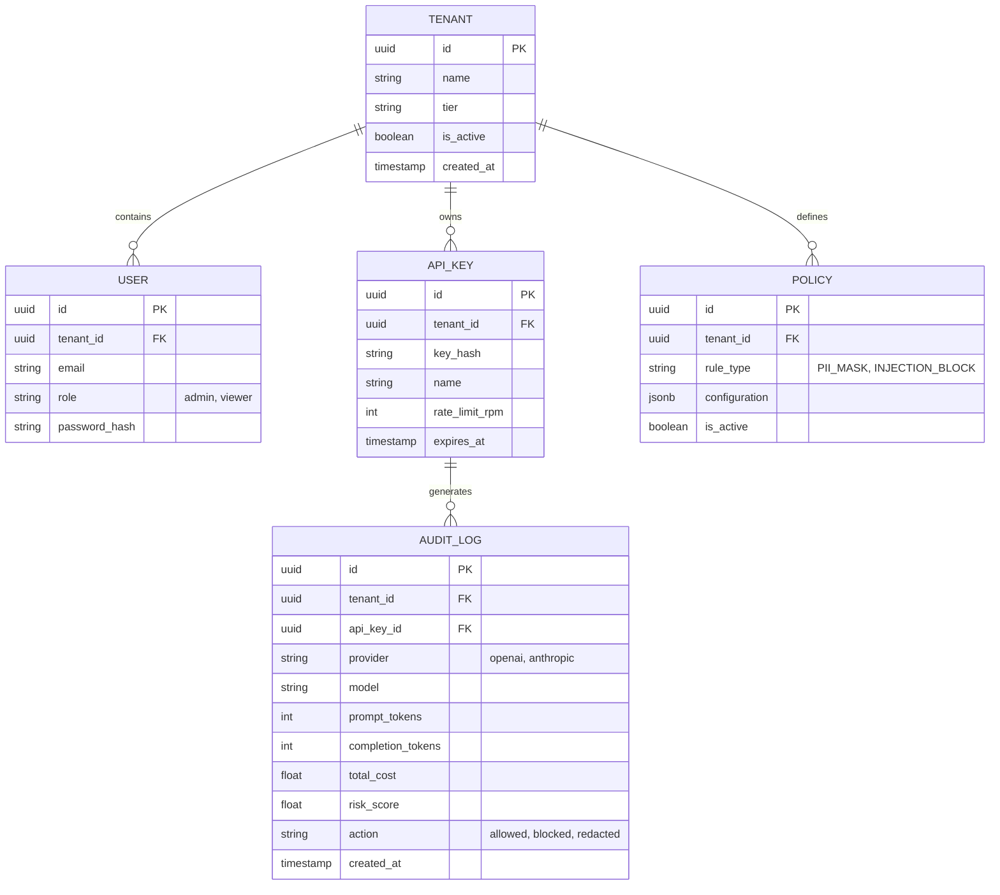
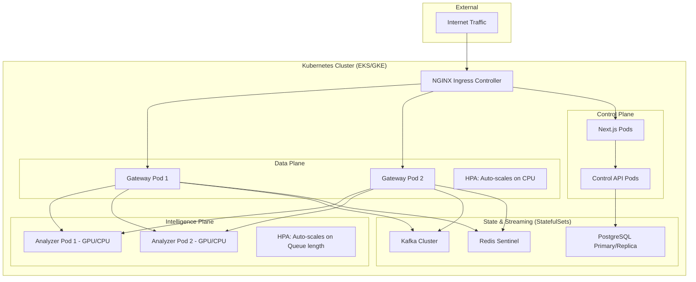

# Enterprise Architecture Design: Zero-Trust LLM Gateway

This document serves as the comprehensive architectural blueprint, addressing the 10 prerequisite requirements before code generation begins.

---

## 1. System Architecture Review & Weakness Identification

The proposed architecture separates concerns effectively into three planes:
*   **Data Plane:** Go Gateway (High throughput, low latency).
*   **Intelligence Plane:** Python ML Analyzer (Heavy compute, GPU/CPU inference).
*   **Control/Management Plane:** Next.js Dashboard (UI, Policy Management).

**Identified Weaknesses in Initial Concept:**
1.  **Synchronous ML Bottlenecks:** Running complex ML models (Transformers) synchronously in the proxy request path will introduce unacceptable latency (e.g., +200-800ms).
2.  **Database Connection Exhaustion:** Writing high-volume audit logs directly to PostgreSQL during traffic spikes will exhaust connection pools and degrade proxy performance.
3.  **Policy Lookup Latency:** Querying PostgreSQL for RBAC and Policies on every request will violate the "low-latency proxy" requirement.
4.  **Analytics Scaling:** PostgreSQL is excellent for transactional data (Users, Tenants) but struggles as an OLAP database for millions of high-dimensional audit logs and token metrics.

---

## 2. Improved Architecture

**Architectural Improvements:**
1.  **Event-Driven Audit Pipeline:** The Gateway will never write directly to PostgreSQL. Instead, it will fire-and-forget events to **Apache Kafka**. A separate consumer service will batch-insert these into the database.
2.  **In-Memory Policy Caching:** Policies and API keys will be synced from Postgres -> Redis -> Go Local Memory (using a high-performance cache like Ristretto). The read-path for policy evaluation will be < 1ms.
3.  **Two-Tier ML Analysis:** 
    *   *Tier 1 (Synchronous):* Fast, rules-based, and lightweight ONNX models for instant blocking (e.g., Presidio for PII, quantized injection classifiers).
    *   *Tier 2 (Asynchronous):* Deep learning models (Toxicity, complex behavioral analysis) run out-of-band. If a threat is detected post-request, the Tenant/User is flagged for subsequent blocking.
4.  **OLAP Integration:** While Postgres will be used for state, we will design the schema to easily migrate the `audit_logs` table to ClickHouse or Elasticsearch in the future.

### Framework Selections & Justifications:
*   **Go Framework: `go-chi/chi`**
    *   *Why not Fiber?* Fiber uses `fasthttp`, which breaks compatibility with the standard `net/http` ecosystem (including standard OpenTelemetry HTTP middlewares and `httputil.ReverseProxy`). `Chi` is 100% standard library compatible, extremely fast, and the industry standard for Go microservices.
*   **Message Bus: `Apache Kafka`**
    *   *Why not RabbitMQ/NATS?* RabbitMQ is great for task queues, but LLM audit logs are high-volume, append-only streams. NATS is fast but requires JetStream for persistence. Kafka is the undisputed enterprise standard for durable, replayable, high-throughput event streaming and SIEM integrations.

---

## 3. Final Architecture Document & Service Diagrams

### Service Interaction Diagram

---

## 4. Database ER Diagram (PostgreSQL)

---

## 5. Deployment Diagram (Kubernetes)

---

## 6. Threat Model (STRIDE)

| Threat Type | Description in Context | Mitigation |
| :--- | :--- | :--- |
| **Spoofing** | Forging API keys to bypass billing/policies. | Cryptographic hashing of API keys in DB (SHA-256). Short-lived JWTs for dashboard. |
| **Tampering** | Intercepting and modifying prompts/responses. | Strict TLS 1.3 everywhere (internal gRPC & external). |
| **Repudiation** | Denying an action (e.g., "I didn't send that PII"). | Immutable, cryptographically signed audit logs sent to Kafka. |
| **Information Disclosure** | System prompts leaking, or the Gateway logging sensitive PII. | Data masking *before* writing to DB/Logs. Presidio integration. |
| **Denial of Service** | Volumetric attacks to exhaust LLM quotas. | Redis-backed sliding-window rate limiting. Circuit breakers using Go `hystrix`. |
| **Elevation of Privilege** | Tenant A accessing Tenant B's logs. | Strict Row-Level Security (RLS) in Postgres. Mandatory `tenant_id` middleware. |

---

## 7. Scaling Strategy

*   **Horizontal Pod Autoscaling (HPA):**
    *   **Go Gateway:** Scales on CPU utilization (>70%). Extremely fast boot times (<1s).
    *   **Python Analyzer:** Scales on custom metrics (e.g., gRPC queue latency). Boot times are slower due to model loading; requires over-provisioning or pre-warmed nodes.
*   **Database Scaling:**
    *   PostgreSQL uses Read Replicas for analytics dashboards.
    *   Audit logs are partitioned by month/week to maintain query performance.
*   **Caching:**
    *   Redis Cluster allows horizontal scaling of rate-limit counters and policy caches.

---

## 8. Disaster Recovery Strategy

*   **RPO (Recovery Point Objective):** < 5 minutes for policies/users. < 1 second for audit logs (Kafka persistence).
*   **RTO (Recovery Time Objective):** < 15 minutes.
*   **Backups:** 
    *   Automated daily snapshots of PostgreSQL + continuous WAL archiving to S3.
    *   Redis persistence (AOF) enabled.
*   **High Availability:** Multi-AZ Kubernetes deployment. Node pools distributed across 3 Availability Zones.
*   **Failover (LLM Providers):** If OpenAI goes down (HTTP 5xx), the Gateway automatically reroutes the request to Azure OpenAI or Anthropic using a fallback configuration defined in the Policy Engine.
