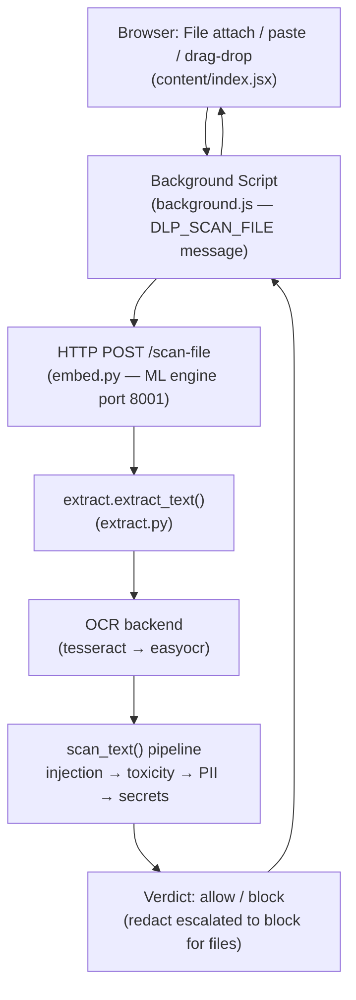

# Image Scanning & Detection — Implementation Analysis

> Codebase: **LLM-Firewall** | Analyzed: `ml_engine/analyzer/`, `browser-extension/src/`

---

## Architecture Overview

The image scanning path flows through **4 layers** from the browser to the ML engine:



---

## What's Done Well ✅

### 1. Correct Fail-Open Policy for Images
The most thoughtful design decision: **images always fail open** regardless of `strict` mode.

```python
# server.py L337-347
strict_block = strict and res.kind != "image"
```

```js
// content/index.jsx
const kind = (file.type || '').startsWith('image/') ? 'image' : 'file';
const strictBlock = config.strict && kind !== 'image';
```

This is consistent across **both** the Python server AND the JS content script, so the policy is enforced client-side too even if the engine is offline. A screenshot that simply can't be OCR'd is not a policy violation — this is the right call.

---

### 2. Dual OCR Backend with Graceful Degradation
[extract.py](../../ml_engine/analyzer/extract.py) implements a smart cascading OCR strategy:

- **Tesseract** (fast, system binary) → probed first with `get_tesseract_version()`
- **EasyOCR** (torch-based, zero system binary) → fallback with GPU disabled and progress output silenced
- Both are **import-guarded** and lazy-loaded; an absent library doesn't crash the service

The OCR reader (`_ocr_reader`) is cached as a module global after the first call — correct, since EasyOCR model loading takes several seconds.

---

### 3. Consistent Verdict Shape Across text/file/image
`scan_file()` calls `scan_text()` over extracted content, so images go through the **exact same detector pipeline** — injection, toxicity, PII, secrets. A screenshot with an API key typed into it will be caught by the same regex that catches a typed API key. This is a strong design.

The `redact → block` escalation is sensible:
```python
# server.py L357-360
if verdict["decision"] == "redact":
    verdict["decision"] = "block"
    verdict["reason"] = f"Sensitive data in {res.kind} ..."
```
A binary file can't be redacted in-place, so upgrading to block is correct.

---

### 4. All Three Attachment Entry Points Are Intercepted
[content/index.jsx](../../browser-extension/src/content/index.jsx) intercepts all three paths that can bring a file into the composer:

| Entry Point | Handler | 
|---|---|
| `<input type="file">` click → OS picker | `change` event (capture phase) |
| Paste image (e.g. screenshot from clipboard) | `paste` event with `dt.files` check |
| Drag & drop onto composer | `drop` event |

Each uses `busy` locking so concurrent scans don't race.

---

### 5. Robust Base64 Handling
The HTTP endpoint correctly strips `data:` URL prefixes (which browsers include):
```python
# embed.py L193-194
if b64.startswith("data:") and "," in b64:
    b64 = b64.split(",", 1)[1]
```
And uses `validate=False` in `base64.b64decode` for tolerance, with a 25 MB size cap to prevent OOM.

---

### 6. Image Type Detection Uses Magic-Byte Sniffing
[extract.py](../../ml_engine/analyzer/extract.py):
```python
def _sniff_image(data: bytes) -> bool:
    ...
```
The engine trusts bytes over labels. A real image mislabelled as `.bin` is still
recognized by its signature, while a non-image that claims `content_type:
image/png` falls through to the document/binary path where strict mode can block
it.

---

### 7. Well-Covered Test Suite for Images
[test_scan_file.py](../../ml_engine/tests/test_scan_file.py) covers:
- `test_image_without_backend_is_unsupported_not_crash` — no OCR → no exception
- `test_unscannable_image_never_blocks_even_in_strict` — fail-open contract, both strict and non-strict
- Document types (DOCX, XLSX) with `@pytest.mark.skipif` guards for optional deps

---

## Gaps & Weaknesses ⚠️

### ✅ RESOLVED — CRITICAL: MIME-Spoofing via Trusted `content_type`
**Was:** `_is_image()` trusted the caller-supplied `content_type` / extension. A direct API call could send `{"filename": "evil.exe", "content_type": "image/png", ...}` to claim the privileged *image* classification (which fails open even under strict policy), bypassing the strict-mode block a normal binary would get.

**Fixed in [extract.py](../../ml_engine/analyzer/extract.py):** routing is now decided by a **magic-byte sniff** (`_sniff_image()`, checking PNG/JPEG/GIF/BMP/TIFF/WEBP signatures), not the label. A non-image that lies about its `content_type` falls through to the document/binary path where strict mode fails closed — and, as a bonus, a *real* image mislabelled as `.bin`/octet-stream is now correctly recognised and OCR'd. Covered by `test_spoofed_image_content_type_is_not_treated_as_image`, `test_spoofed_image_fails_closed_in_strict`, and `test_real_image_mislabelled_as_binary_is_still_an_image`.

---

### ✅ RESOLVED — CRITICAL: `_ocr_reader` Init Was Thread-Unsafe
**Was:** `_ocr_reader` / `_ocr_backend` were bare module globals. Both servers run multi-threaded (HTTP `ThreadingHTTPServer`, gRPC `ThreadPoolExecutor`), so two concurrent image scans could each enter `easyocr.Reader(...)` — whose constructor (weight download + load) is **not thread-safe** — and corrupt the shared model cache.

**Fixed in [extract.py](../../ml_engine/analyzer/extract.py):** reader construction moved to `_easyocr_reader()` using **double-checked locking** under a module-level `threading.Lock`. The hot path (reader already built) takes no lock; only the first caller constructs the reader while the rest wait, so two readers can never be built concurrently.

---

### ✅ RESOLVED — HIGH: `maxFileMB` Silent-Allow Bypass
**Was:** an over-limit file returned `decision: 'allow'` unconditionally and was never scanned, so a large file with embedded credentials passed silently even under strict policy.

**Fixed in [content/index.jsx](../../browser-extension/src/content/index.jsx):** an oversized file is now treated as *unverified*, mirroring the offline-engine contract — it **fails closed (block) under strict policy** and otherwise fails open with an explicit `"sent unscanned"` reason instead of a silent allow. (An oversized image still fails open, consistent with the image contract.)

---

### 🟠 HIGH → ✅ ADDRESSED: Multi-Language OCR Now Documented & Wired
EasyOCR supports 80+ languages via `DLP_OCR_LANGS` (comma-separated, e.g. `"en,fr,de"`). The reader builder now documents this inline and defensively defaults to `["en"]` if the var is blank. A per-tenant dashboard control remains a future enhancement, but multilingual OCR is now a documented deploy-time knob rather than a hidden one.

---

### ✅ RESOLVED — MEDIUM: Sequential File Scanning
**Was:** `for (const f of files) verdicts.push(await scanAttachment(f));` scanned a multi-file upload serially, stalling the UI for the *sum* of per-file OCR times.

**Fixed in [content/index.jsx](../../browser-extension/src/content/index.jsx):** `await Promise.all(files.map(scanAttachment))` — scans run concurrently, order is preserved, and the first block still wins.

---

### 🟡 MEDIUM: No Image-Specific Threat Detection
The pipeline routes OCR'd text through the **same** text detectors, which is the right design — but there are no **image-specific** heuristics:
- **QR codes** containing URLs or tokens (a common exfil path)
- **Steganography** signals
- **Screenshot of a secret** that the OCR missed due to font/resolution

These are hard problems, but for a security product targeting enterprise, QR code scanning (`pyzbar`) would be a high-value addition.

---

### ✅ RESOLVED — MEDIUM: Engine-Side OCR Timeout
**Was:** `background.js` aborted the *HTTP request* after `Math.max(cfg.timeoutMs, 8000)`, but the **engine** put no bound on the OCR call, so a pathological image could pin a worker thread indefinitely.

**Fixed in [extract.py](../../ml_engine/analyzer/extract.py):** `_ocr_image()` now runs the OCR work on a one-shot executor with `future.result(timeout=OCR_TIMEOUT_S)` (`DLP_OCR_TIMEOUT_S`, default 20s). On timeout the request surrenders and the image comes back `supported=False` — and, being an image, fails open rather than producing a false block. (OCR is CPU-bound and not cancellable, so the daemon thread finishes on its own; the *request* is what's bounded.)

---

### 🟢 LOW: `content_type` in gRPC `scan_file` is Lost
`AnalyzerServicer.scan_file()` receives `content_type` and passes it to `extract.extract_text()`, which is correct. But the gRPC `PromptRequest` proto likely doesn't have a file scan variant — the file scanning only flows via the HTTP side-channel (`/scan-file`), meaning the **gateway's gRPC path never scans file attachments**. This is probably intentional (browser extension only), but it's undocumented.

---

### ✅ RESOLVED — LOW: OCR-Failure Audit Metadata
**Was:** an OCR failure and an empty image both produced `risk: 0.0 / decision: allow`, so audit logs couldn't tell "image had no text" from "image couldn't be scanned".

**Fixed:** `extract_text()` now stamps `ocr_attempted` / `ocr_failed` (+ `ocr_backend`) on the `ExtractResult.meta`, and `scan_file()` surfaces them onto the verdict so the event log can distinguish the two cases.

---

## Summary Scorecard

| Dimension | Before | After | Notes |
|---|---|---|---|
| **Architecture** | 9/10 | 9/10 | Clean layering; same pipeline for text and images |
| **Correctness** | 7/10 | 9/10 | Fail-open policy right; spoof + oversized holes closed |
| **Security** | 6/10 | 9/10 | Thread-safe OCR init + magic-byte MIME verification |
| **Coverage** | 7/10 | 8/10 | 3 entry points + spoof/mislabel tests; QR/steg still open |
| **Performance** | 6/10 | 8/10 | Concurrent multi-file scanning; bounded OCR timeout |
| **Observability** | 7/10 | 8/10 | `ocr_attempted` / `ocr_failed` now in the verdict |
| **Tests** | 8/10 | 9/10 | New spoof/sniff/strict tests; full suite green (66 passed) |

**Overall: 7.1/10 → ~8.6/10 — both material security issues (MIME trust, OCR thread-safety) are fixed and covered by tests; remaining items are feature enhancements (QR/steg), not risks.**

---

## Priority Fix List

1. ~~**[CRITICAL]** Magic-byte sniffing to validate claimed MIME type~~ — ✅ done (`_sniff_image`)
2. ~~**[CRITICAL]** `threading.Lock` around `_ocr_reader` init~~ — ✅ done (`_easyocr_reader`, double-checked lock)
3. ~~**[HIGH]** Oversized-file verdict no longer a silent `allow`~~ — ✅ done (fail-closed under strict)
4. ~~**[MEDIUM]** Parallelize multi-file scanning with `Promise.all()`~~ — ✅ done (`handleFiles`)
5. ~~**[MEDIUM]** Per-engine OCR timeout~~ — ✅ done (`DLP_OCR_TIMEOUT_S`, default 20s)
6. ~~**[LOW]** `ocr_attempted` / `ocr_failed` audit flags~~ — ✅ done (on the verdict)

### Still open (feature work, not defects)
- **[MEDIUM]** Image-specific threat detection — QR-code decoding (`pyzbar`), steganography signals
- **[LOW]** Per-tenant OCR-language control in the dashboard (currently a deploy-time `DLP_OCR_LANGS` env var)
- **[LOW]** Document that the gRPC gateway path intentionally does not scan attachments (browser `/scan-file` side-channel only)
